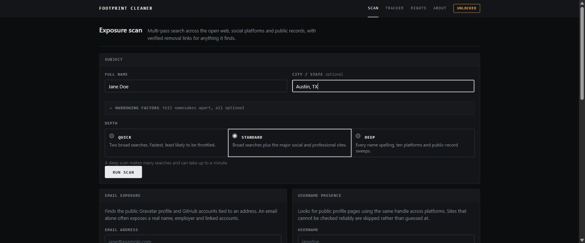
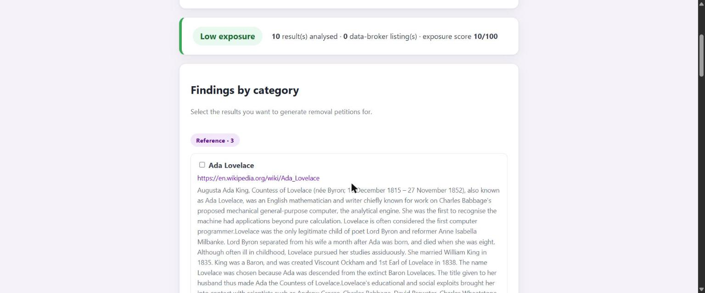
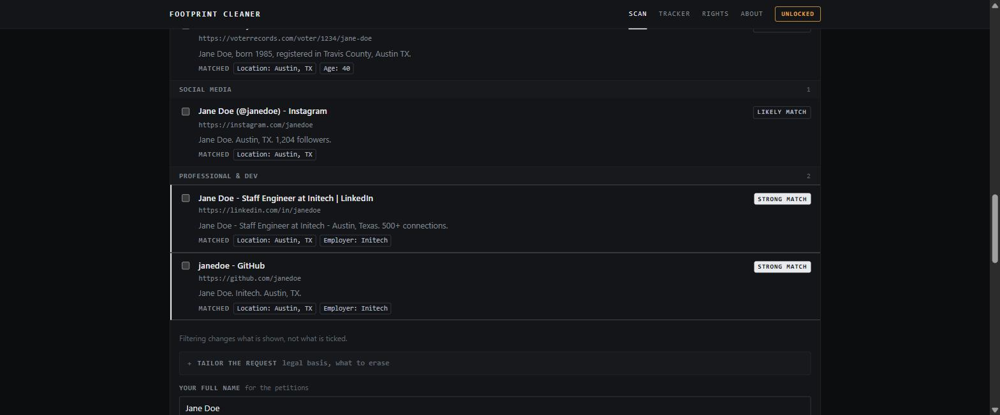
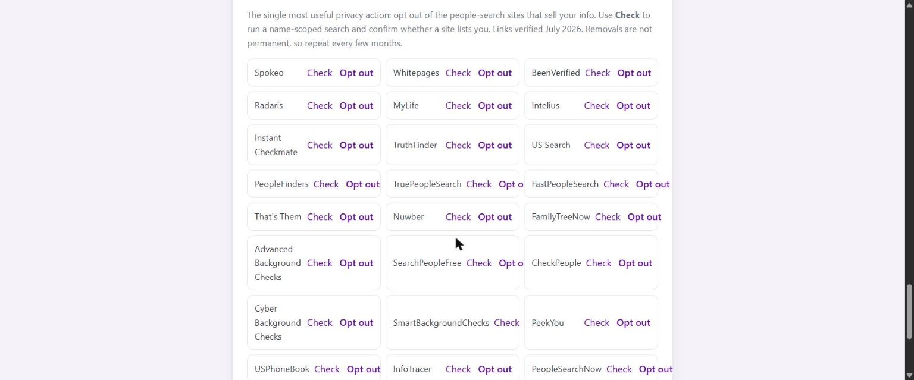
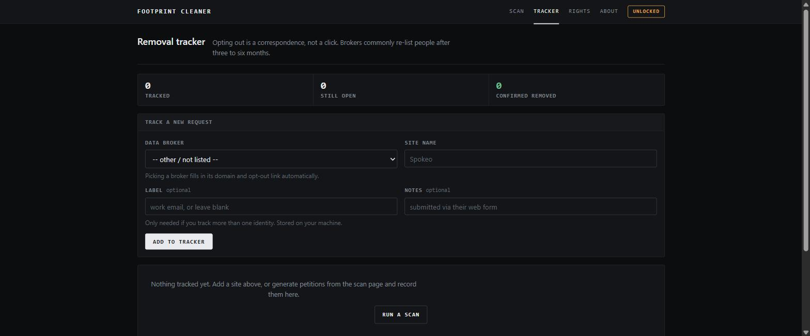

# Digital Footprint Cleaner

[](LICENSE_MIT.md)
[](https://www.python.org/)
[](https://flask.palletsprojects.com/)
[](tests/)
[](SECURITY.md)

A privacy-first, open-source web app that helps you find where your personal
information is exposed online and generate ready-to-send data-removal requests.

## Screenshots

**Scan.** Name and location, plus optional narrowing factors that tell namesakes
apart. Depth is yours to choose:



**Exposure report.** A readout of what was checked and what was found, coverage
reported as prominently as results, and broker listings called out first:



**Match confidence.** Every result says why it is believed to be you, with the
facts that matched. Results that never name the subject are separated out:



**Data-broker checklist.** Verified opt-out links for 30+ people-search sites,
plus a per-broker check to confirm whether one lists you:



**Removal tracker.** Opting out is a correspondence, not a click:



## Features

- **Deep multi-pass search.** A scan is a *plan* of narrow searches, not one broad
  query: name variants (`Jane Doe`, `Doe, Jane`, `Jane M Doe`), a location-scoped
  pass, site-scoped checks against ten platforms, and public-record sweeps. Choose
  Quick, Standard or Deep depending on how much coverage you want.
- **Narrowing factors.** Supply an employer, school, age, phone, relatives or
  aliases and every result is scored against them, so a different Jane Doe in
  another state sinks instead of being reported as your exposure. These are
  deliberately **never added to the query**: every extra search term ANDs against
  a full-text index, so a factor-stuffed query finds *fewer* pages, not more.
- **Match confidence.** Each result is banded strong / likely / possible, with the
  matched facts shown so you can see *why*. Pages that never name the subject are
  split out separately rather than counted in your score.
- **Scan coverage reporting.** A deep scan makes many requests and some will fail.
  The page says "9 of 11 checks completed" and names the ones that did not, so a
  throttled sweep can never be mistaken for a clean result.
- **Exposure report.** Results are classified (data brokers, social media, professional, public records, news) and given an overall risk score driven by data-broker presence.
- **Data-broker opt-out checklist.** Direct, verified opt-out links for 30+ major US people-search sites (Spokeo, Whitepages, BeenVerified, Radaris). This is the most useful privacy action and the tool's core value.
- **Data-broker deep check.** Runs a site-scoped search against each broker individually, finding listing pages that a general web search does not rank. This is the direct fix for the tool's oldest limitation.
- **Email signals.** Shows what an email address alone gives away: a public Gravatar profile can expose your real name, location, employer and linked social accounts, plus any GitHub account registered to that address.
- **Username presence check.** Looks for public profile pages using the same handle across 17 platforms, and is explicit about which ones cannot be checked reliably instead of guessing.
- **Customisable removal petitions.** Choose the legal basis (GDPR, CCPA/CPRA, India's DPDP Act, or a neutral request) and exactly which data to demand erasure of (address, phone, relatives, employment, ...). Each petition cites the right statute and deadline.
- **Removal tracker.** A local dashboard recording who you wrote to, what they said, and what still needs chasing. Brokers re-list people after three to six months, so this is where the long game is won.
- **Legal guide** to inform you of your rights.
- **Security-hardened** by default (CSRF protection, strict CSP, hardened cookies, cost-weighted rate limiting). See [Security](#security).
- **Localhost-only by construction.** The app refuses any request whose `Host`
  header is not localhost, which is what blocks DNS rebinding: without that check
  any web page you have open can reach a service bound to 127.0.0.1 and be
  treated as same-origin, and CSRF tokens do not stop it.
- **Optional passcode lock.** Set `DFC_PASSCODE` and every page requires a login:
  PBKDF2-SHA256 with a per-install salt, constant-time comparison, throttled
  attempts, session rotation on login, and an idle timeout. When no passcode is
  set the header says **Unlocked** rather than letting you assume otherwise.
- **Dense, monochrome UI** built for reading results rather than for a landing
  page. Colour is reserved strictly for status: red exposed, amber could-not-check,
  green clear: so an "unknown" can never blend into ordinary chrome.
- **No JavaScript at all.** Disclosure panels and the confidence filter are
  `details/summary` and `:checked` CSS. Everything works with scripting disabled,
  which is what lets the Content-Security-Policy stay as strict as it is.
- Written entirely in Python and HTML, no paid services required.

### Honest by design: three states, not two

Every check reports **found**, **not found**, or **unknown**: and the UI colours
them differently. "Unknown" means the check was blocked, throttled or timed out.

This distinction is the whole point. Telling someone they are absent from a data
broker when the check merely failed is the most damaging thing a privacy tool can
get wrong, and it is what most username-checker style tools do. Platforms that
answer unreliably (Instagram, X, TikTok, Twitch, Tumblr all return "200 OK" for
every handle) are not requested at all, rather than guessed at.

### How it works, and its honest limits

A plain web search surfaces mentions of you, but the real privacy exposure is
the data-broker / people-search sites that aggregate your address, phone, age,
and relatives. This tool:

1. Runs a privacy-respecting web search and classifies every result.
2. Flags any data-broker listing that appears in results and links its opt-out page.
3. Runs a **deep check**, one site-scoped search per broker, to find listings the
   broad scan misses.
4. Always shows a proactive opt-out checklist for the major brokers.
5. Generates a petition citing the law that applies to you, and tracks it to completion.

**What got better.** A general web search does not reliably rank data-broker
listing pages, so the automatic "detected on broker X" step used to find nothing
even when you were listed. The deep check attacks that directly by querying each
broker's domain individually.

**What is still true.** The deep check is bounded: it covers the first 8 brokers
within a 25-second budget, because the search backend throttles aggressively.
Brokers beyond that are reported as `skipped`, not as "clean". Results are cached
for 15 minutes. Broker removals are also not permanent: data typically reappears
in 3 to 6 months: which is exactly what the removal tracker is for.

**Email and username checks have limits too.** GitHub only finds accounts whose
owner made their email public, and without a `GITHUB_TOKEN` that probe is
rate-limited to ~10 requests per minute for the whole process, so it will often
report `unknown`. A username match means a profile page exists at that address,
not that it belongs to you.

This tool is for checking your own footprint, or someone's with their consent,
not for looking up third parties. It takes one name or one username at a time and
deliberately implements no bulk or CSV input.

## Your data

- **Nothing is sent to us.** There is no backend service; the app talks only to
  the sites being checked (DuckDuckGo, Gravatar, GitHub, and the platforms in the
  username check).
- **The removal tracker stores data locally** in `instance/tracker.sqlite3`
  (gitignored, override with `DFC_DB_PATH`). It records site names, statuses and
  your own notes: never search results or scan output.
- **Delete everything at any time** with the "Delete All Tracked Requests" button
  on the dashboard.
- Remote images are never loaded. A Gravatar avatar is reported as existing and
  linked, not embedded, so viewing a report does not announce your IP to a third
  party.

## Tech Stack

- **Frontend**: HTML (Jinja2 templates) and a static stylesheet. No JavaScript, which is what lets the Content Security Policy stay this strict.
- **Backend**: Python (Flask).
- **Search**: [`ddgs`](https://pypi.org/project/ddgs/), a free, privacy-respecting DuckDuckGo client.
- **HTTP probes**: [`httpx`](https://www.python-httpx.org/), with per-request timeouts and a bounded thread pool.
- **Storage**: SQLite (standard library) for the local removal tracker. No database server to run.
- **Analysis**: custom result classification, broker detection, and risk scoring.
- **Tests**: `pytest`; `mypy`, `pyflakes` and `pycodestyle` for static analysis.

> Note: this project uses the maintained `ddgs` package. The older
> `duckduckgo-search` package is deprecated and no longer returns results, so it
> has been replaced.

## Installation

1. Clone the repo:

   ```bash
   git clone https://github.com/Codex-Crusader/digital-footprint-cleaner.git
   cd digital-footprint-cleaner
   ```

2. Create and activate a virtual environment:

   ```bash
   python -m venv .venv
   source .venv/bin/activate        # On Windows: .venv\Scripts\activate
   ```

3. Install dependencies:

   ```bash
   pip install -r requirements.txt
   ```

4. Run the app:

   ```bash
   python app.py
   ```

5. Open `http://127.0.0.1:5000` in your browser.

## Configuration

All configuration is read from environment variables. Copy `.env.example` to
`.env` for reference, then export the values in your shell (the app does not
auto-load `.env`).

| Variable | Default | Purpose |
|----------|---------|---------|
| `SECRET_KEY` | random, ephemeral | Signs session cookies. Set a strong value in production. Generate one with `python -c "import secrets; print(secrets.token_hex(32))"`. |
| `FLASK_ENV` | `production` | Set to `development` to enable debug mode locally. Never use `development` in production. |
| `SESSION_COOKIE_SECURE` | `false` | Set to `true` to send session cookies only over HTTPS. |
| `SEARCH_RATE_LIMIT` | `70` | Rate-limit budget per IP within the window, counted in **tokens**, not requests. A deep scan is charged the size of its own query plan (~17 at "deep"); a broker deep check costs 8, a username check 12, an email check 3: roughly one token per upstream request they make. |
| `SEARCH_RATE_WINDOW` | `60` | Rate-limit window in seconds. |
| `SEARCH_MIN_INTERVAL` | `0.35` | Minimum seconds between upstream search requests, enforced by a gate shared by every search in the process. Widens automatically when the backend throttles, narrows again on success. |
| `SEARCH_MAX_CONCURRENCY` | `3` | Ceiling on simultaneous upstream searches. Raising it does **not** make scans faster: DuckDuckGo throttles parallel bursts, so more workers returns less data. |
| `DEEP_SEARCH_BUDGET` | `40` | Wall-clock seconds for a whole deep scan. Passes run in significance order; whatever is unreached is reported as `skipped`, never as "nothing found". |
| `GITHUB_TOKEN` | unset | Optional. Raises the GitHub search rate limit for the email-signals check. A token with **no scopes** is sufficient. Without it that probe usually reports `unknown`. |
| `DFC_PASSCODE_HASH` | unset | Enables the passcode lock. Generate with `python -c "from utils.auth import hash_passcode; print(hash_passcode('your passcode'))"`. Preferred over `DFC_PASSCODE` because the plaintext never enters the environment. |
| `DFC_PASSCODE` | unset | Convenience alternative to the above: the plaintext passcode, hashed at startup. |
| `DFC_IDLE_TIMEOUT` | `1800` | Seconds an unlocked session may sit idle before it locks again. |
| `DFC_ALLOWED_HOSTS` | unset | Extra hostnames the app will answer to, comma separated. `localhost`, `127.0.0.1` and `::1` are always allowed; everything else is refused. |
| `DFC_DB_PATH` | `instance/tracker.sqlite3` | Where the removal tracker stores its local SQLite database. |

## Security

Security controls are applied by default and centralised in `app.py` for easy auditing:

- CSRF protection on every `POST` (per-session token, constant-time comparison).
- Content Security Policy with no inline scripts or styles and no third-party origins.
- Anti-clickjacking (`X-Frame-Options: DENY`, CSP `frame-ancestors 'none'`).
- Hardened session cookies (`HttpOnly`, `SameSite=Lax`, optional `Secure`).
- URL validation: only `http`/`https` result links are rendered, blocking `javascript:` and `data:` injection.
- Request-size limit and per-IP rate limiting on search.

See [SECURITY.md](SECURITY.md) for the full list and deployment guidance.

## Testing

```bash
pip install -r requirements-dev.txt
pytest
```

The suite covers input validation, URL sanitisation, result classification and
risk scoring, broker detection, the broker deep check, email signals, username
presence checks, petition generation, the removal tracker, the (mocked) search
backend, and the security controls (CSRF, headers, rate limiting).

**No test touches the network.** Every outbound call is behind an injected HTTP
client or a monkeypatched backend, so the suite is fast, deterministic and
offline. `pytest.ini` sets `filterwarnings = error`, so any new warning fails the
build.

Static analysis: all four must be clean before a PR:

```bash
pytest                                                   # 192 tests
mypy                                                     # config in pyproject.toml
pycodestyle app.py scanner.py analysis.py utils tests    # config in setup.cfg
pyflakes  app.py scanner.py analysis.py utils tests
```

## Project Structure

```
digital-footprint-cleaner/
├── app.py                  # Flask app + security controls (CSRF, headers, rate limiting)
├── scanner.py              # Search execution, shared rate governor, deep multi-pass scan
├── analysis.py             # Classification, broker detection, match confidence, risk scoring
├── pyproject.toml          # Project metadata, dependency list, mypy config
├── setup.cfg               # pycodestyle config (it cannot read pyproject.toml)
├── requirements.txt        # Runtime dependencies (mirrors pyproject.toml)
├── requirements-dev.txt    # Test dependencies
├── pytest.ini              # Test configuration
├── .env.example            # Documented configuration template
├── SECURITY.md             # Security policy & protections
├── utils/
│   ├── auth.py             # Passcode lock, host allowlist, login throttling
│   ├── identity.py         # Subject profile: name splitting, variants, match factors
│   ├── search_plan.py      # Builds the deep-search query plan (pure, testable)
│   ├── result_store.py     # Short-lived in-memory scan results (never on disk)
│   ├── validation.py       # Shared input/URL validation helpers
│   ├── http_client.py      # Structural type for the injectable HTTP client
│   ├── petition_writer.py  # Petition generation from legal basis + data types
│   ├── email_signals.py    # Gravatar profile + GitHub-by-email probes
│   ├── username_check.py   # Cross-platform username presence checks
│   └── tracker.py          # Local SQLite store for removal requests
├── templates/
│   ├── base.html           # Shared shell: nav, flashes, footer
│   ├── index.html          # Scan, probes, results, petitions
│   ├── dashboard.html      # Removal-request tracker
│   ├── legal.html          # Your rights
│   ├── login.html          # Passcode unlock
│   └── about.html          # Creator and design notes
├── static/
│   └── css/style.css       # All styling (kept external for a strict CSP)
├── tests/                  # pytest suite (362 tests)
├── data/
│   ├── brokers.json        # Curated, verified data-broker opt-out registry
│   └── petition_templates.json  # Legal bases, data types, petition body
├── instance/               # Local tracker database (gitignored, created on demand)
├── LICENSE_MIT.md
├── README.md
└── .gitignore
```

> Note on `data/`: `.gitignore` ignores `data/*.json` and re-includes each
> curated file explicitly. If you add a data file, add an `!data/yourfile.json`
> exception too, or it will be missing from a fresh clone and the app will
> silently fall back to its built-in defaults.

## Roadmap

Shipped since 1.0: email signals, username presence checks, customisable
petition templates, the removal-request dashboard, the broker deep check, and
in 1.2 the deep multi-pass scan, identity narrowing with match confidence, scan
coverage reporting and the rebuilt interface.

Still open:

- Optional breach checking (requires an API key from a provider such as Have I Been Pwned).
- Scheduled re-checks, so re-listed broker data is caught automatically rather than
  relying on the user to remember.
- Export the tracker to CSV/JSON for people who want their records outside the app.
- Broaden the broker registry beyond US people-search sites (EU and India equivalents).

## Contributing

Contributions are welcome. See [CONTRIBUTING.md](contributing.md) for guidelines.

You can suggest features, improve petition logic, add broker entries or legal
templates, refine search filters, or improve documentation.

Fork it, improve it, submit a PR.

## License

This project is licensed under the [MIT License](LICENSE_MIT.md).

## Acknowledgements

- [DuckDuckGo](https://duckduckgo.com) for privacy-friendly web search.
- [Flask](https://flask.palletsprojects.com) for its lightweight Python web framework.
- The maintained [Big-Ass Data Broker Opt-Out List](https://github.com/yaelwrites/Big-Ass-Data-Broker-Opt-Out-List) for verified opt-out references.
